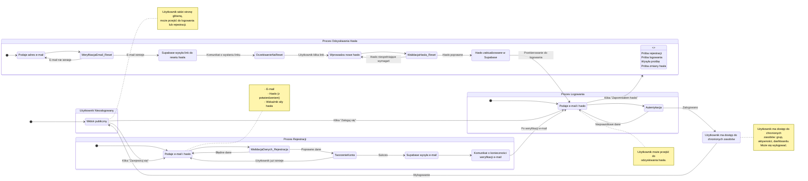

```mermaid
stateDiagram-v2
    direction LR
    [*] --> StronaGlowna_Niezalogowany

    state "Użytkownik Niezalogowany" as Guest {
        StronaGlowna_Niezalogowany: Widok publiczny
        note right of StronaGlowna_Niezalogowany
            Użytkownik widzi stronę główną,
            może przejść do logowania lub rejestracji.
        end note
    }

    state "Proces Rejestracji" as Rejestracja {
        [*] --> FormularzRejestracji
        FormularzRejestracji: Podaje e-mail i hasło
        note right of FormularzRejestracji
            - E-mail
            - Hasło (z potwierdzeniem)
            - Wskaźnik siły hasła
        end note

        FormularzRejestracji --> WalidacjaDanych_Rejestracja <<choice>> : Próba rejestracji
        WalidacjaDanych_Rejestracja --> FormularzRejestracji: Błędne dane
        WalidacjaDanych_Rejestracja --> TworzenieKonta: Poprawne dane

        TworzenieKonta --> WyslanieMailaWeryfikacyjnego: Sukces
        TworzenieKonta --> FormularzRejestracji: Użytkownik już istnieje

        WyslanieMailaWeryfikacyjnego: Supabase wysyła e-mail
        WyslanieMailaWeryfikacyjnego --> OczekiwanieNaWeryfikacje
        OczekiwanieNaWeryfikacje: Komunikat o konieczności weryfikacji e-mail
    }

    state "Proces Logowania" as Logowanie {
        [*] --> FormularzLogowania
        FormularzLogowania: Podaje e-mail i hasło
        note right of FormularzLogowania
            Użytkownik może przejść do
            odzyskiwania hasła.
        end note
        FormularzLogowania --> Autentykacja <<choice>> : Próba logowania

        Autentykacja --> FormularzLogowania: Nieprawidłowe dane
    }

    state "Proces Odzyskiwania Hasła" as OdzyskiwanieHasla {
        [*] --> FormularzOdzyskiwania
        FormularzOdzyskiwania: Podaje adres e-mail
        FormularzOdzyskiwania --> WeryfikacjaEmail_Reset <<choice>> : Wysyła prośbę
        
        WeryfikacjaEmail_Reset --> WyslanieInstrukcjiResetu: E-mail istnieje
        WeryfikacjaEmail_Reset --> FormularzOdzyskiwania: E-mail nie istnieje
        
        WyslanieInstrukcjiResetu: Supabase wysyła link do resetu hasła
        WyslanieInstrukcjiResetu --> OczekiwanieNaReset: Komunikat o wysłaniu linku
        
        OczekiwanieNaReset --> FormularzNowegoHasla: Użytkownik klika link
        
        FormularzNowegoHasla: Wprowadza nowe hasło
        FormularzNowegoHasla --> WalidacjaHasla_Reset <<choice>> : Próba zmiany hasła
        
        WalidacjaHasla_Reset --> FormularzNowegoHasla: Hasło niespełniające wymagań
        WalidacjaHasla_Reset --> AktualizacjaHasla: Hasło poprawne
        
        AktualizacjaHasla: Hasło zaktualizowane w Supabase
    }

    Aplikacja_Zalogowany: Użytkownik ma dostęp do chronionych zasobów
    note right of Aplikacja_Zalogowany
        Użytkownik ma dostęp do chronionych
        zasobów: grup, aktywności, dashboardu.
        Może się wylogować.
    end note

    StronaGlowna_Niezalogowany --> FormularzLogowania: Klika "Zaloguj się"
    StronaGlowna_Niezalogowany --> FormularzRejestracji: Klika "Zarejestruj się"
    
    OczekiwanieNaWeryfikacje --> FormularzLogowania: Po weryfikacji e-mail
    
    FormularzLogowania --> OdzyskiwanieHasla: Klika "Zapomniałem hasła"
    Autentykacja --> Aplikacja_Zalogowany: Zalogowano
    
    AktualizacjaHasla --> FormularzLogowania: Przekierowanie do logowania
    
    Aplikacja_Zalogowany --> StronaGlowna_Niezalogowany: Wylogowanie

```
