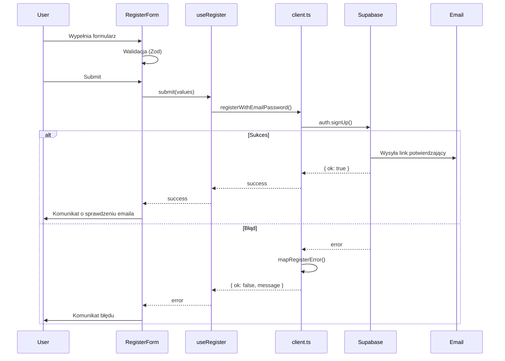

# Implementacja Rejestracji Użytkowników

## Przegląd

Zaimplementowano pełną funkcjonalność rejestracji użytkowników z wykorzystaniem Supabase Auth, zgodnie z wytycznymi z `@supabase-auth.mdc`. Implementacja jest spójna z istniejącą logiką logowania.

## Struktura Implementacji

### 1. Client-side Auth Function (`src/lib/auth/client.ts`)

Dodano funkcję `registerWithEmailPassword()` obsługującą rejestrację:

**Kluczowe funkcje:**
- Komunikacja z Supabase Auth przez `createSupabaseBrowserInstance()`
- Wywołanie `supabase.auth.signUp()` z email i hasłem
- Mapowanie błędów Supabase na przyjazne komunikaty w języku polskim
- Obsługa różnych scenariuszy błędów:
  - `email_already_exists` - email już zarejestrowany (400)
  - `weak_password` - hasło nie spełnia wymagań (422)
  - `too_many_requests` - rate limiting (429)
  - `network_error` - problemy z połączeniem
  - `unknown_error` - nieoczekiwane błędy

**Typy:**
```typescript
export interface RegisterFormValues {
  email: string;
  password: string;
  confirmPassword: string;
}

export type RegisterErrorCode = 
  | "email_already_exists" 
  | "weak_password" 
  | "too_many_requests" 
  | "network_error" 
  | "unknown_error";

export type RegisterResult = 
  | { ok: true } 
  | { ok: false; code: RegisterErrorCode; message: string };
```

### 2. React Hook (`src/lib/auth/useRegister.ts`)

Hook `useRegister()` zapewnia state management dla formularza rejestracji:

**Funkcjonalność:**
- Stan `loading` dla UI feedback (wskaźnik ładowania)
- Funkcja `submit()` wywołująca logikę rejestracji
- Automatyczne zarządzanie stanem loading (try/finally)

**Wykorzystanie:**
```typescript
const { loading, submit } = useRegister();
const result = await submit(values);
```

### 3. Formularz React (`src/components/auth/RegisterForm.tsx`)

Komponent `RegisterForm` był już zaimplementowany i działa prawidłowo z nowym backendem:

**Kluczowe funkcje:**
- Walidacja za pomocą `react-hook-form` + Zod schema
- Wskaźnik siły hasła (`PasswordStrengthIndicator`)
- Potwierdzenie hasła z walidacją zgodności
- Obsługa błędów z focusem na pierwszym błędnym polu
- **Komunikat o potwierdzeniu emaila** po pomyślnej rejestracji:
  > "Konto zostało utworzone! Sprawdź swoją skrzynkę email i potwierdź adres, aby się zalogować."

### 4. Strona Rejestracji (`src/pages/auth/register.astro`)

Strona Astro renderowana server-side:

**Konfiguracja:**
- `export const prerender = false` - wymusza SSR
- Ukryty topbar (`hideTopbar={true}`)
- Komponent `RegisterCard` ładowany client-side (`client:load`)
- Publiczna ścieżka (dodana w middleware)

## Przepływ Rejestracji



## Walidacja Hasła

Schema Zod w `src/lib/validation/auth.ts` wymaga:

1. **Minimalna długość:** 8 znaków
2. **Przynajmniej jedna mała litera:** `/[a-z]/`
3. **Przynajmniej jedna wielka litera:** `/[A-Z]/`
4. **Przynajmniej jedna cyfra:** `/[0-9]/`
5. **Brak spacji:** `/^\S+$/`
6. **Zgodność haseł:** `password === confirmPassword`

## Middleware i Routing

Ścieżka `/auth/register` jest oznaczona jako publiczna w `src/middleware/index.ts`:

```typescript
const PUBLIC_PATHS = [
  "/",
  "/auth/login",
  "/auth/register",  // ✅ Dostępne bez logowania
  "/auth/forgot-password",
  "/auth/reset-password",
  "/api/auth/logout",
];
```

## Obsługa Email Verification (Supabase)

### Domyślne Zachowanie Supabase

Po wywołaniu `supabase.auth.signUp()`:

1. **Supabase automatycznie wysyła email** z linkiem potwierdzającym
2. Link zawiera token weryfikacyjny
3. Po kliknięciu użytkownik jest przekierowany (domyślnie do `/`)
4. **Użytkownik NIE MOŻE się zalogować** przed potwierdzeniem emaila

### Konfiguracja Email Templates (Supabase Dashboard)

Aby dostosować email, przejdź do:
```
Authentication → Email Templates → Confirm signup
```

Przykładowy link potwierdzający:
```
{{ .ConfirmationURL }}
```

### Obsługa po Kliknięciu w Link

Supabase automatycznie obsługuje weryfikację. Możesz dostosować redirect URL:

```typescript
// W przyszłości można dodać custom redirect
const { error } = await supabase.auth.signUp({
  email: values.email,
  password: values.password,
  options: {
    emailRedirectTo: `${window.location.origin}/auth/login?verified=true`
  }
});
```

## Testy Manualne

### 1. Rejestracja z prawidłowymi danymi

```bash
# Otwórz przeglądarkę
open http://localhost:4321/auth/register

# Wypełnij formularz:
# Email: test@example.com
# Hasło: TestPass123
# Powtórz hasło: TestPass123

# Oczekiwany rezultat:
# ✅ Zielony komunikat: "Konto zostało utworzone! Sprawdź swoją skrzynkę email..."
# ✅ Email weryfikacyjny wysłany do test@example.com
```

### 2. Rejestracja z istniejącym emailem

```bash
# Po pierwszej rejestracji, spróbuj ponownie z tym samym emailem

# Oczekiwany rezultat:
# ❌ Czerwony komunikat: "Ten email jest już zarejestrowany."
```

### 3. Słabe hasło

```bash
# Wypełnij formularz:
# Email: new@example.com
# Hasło: weak
# Powtórz hasło: weak

# Oczekiwany rezultat:
# ❌ Walidacja frontendowa blokuje submit
# ❌ Komunikaty pod polem hasła o brakujących wymaganiach
```

### 4. Niezgodne hasła

```bash
# Wypełnij formularz:
# Email: new@example.com
# Hasło: TestPass123
# Powtórz hasło: TestPass456

# Oczekiwany rezultat:
# ❌ Komunikat pod drugim polem: "Hasła muszą się zgadzać"
```

## API Endpoint (Opcjonalny)

Implementacja używa **bezpośredniej komunikacji z Supabase** (client-side), podobnie jak login. Nie ma dedykowanego endpointu `/api/auth/register`.

Jeśli w przyszłości będzie potrzebny server-side endpoint:

```typescript
// src/pages/api/auth/register.ts
import type { APIRoute } from "astro";
import { createSupabaseServerInstance } from "@/db/supabase.client";
import { registerSchema } from "@/lib/validation/auth";

export const POST: APIRoute = async ({ request, cookies }) => {
  try {
    const body = await request.json();
    const validated = registerSchema.parse(body);

    const supabase = createSupabaseServerInstance({
      cookies,
      headers: request.headers,
    });

    const { data, error } = await supabase.auth.signUp({
      email: validated.email,
      password: validated.password,
    });

    if (error) {
      return new Response(
        JSON.stringify({ error: error.message }),
        { status: 400 }
      );
    }

    return new Response(
      JSON.stringify({ data }),
      { status: 201 }
    );
  } catch (error) {
    return new Response(
      JSON.stringify({ error: "Invalid request" }),
      { status: 400 }
    );
  }
};
```

**Uwaga:** Obecna implementacja NIE wymaga tego endpointu.

## Bezpieczeństwo

### ✅ Dobre Praktyki

1. **httpOnly cookies** - sesja Supabase przechowywana bezpiecznie
2. **Walidacja client-side** - Zod schema z wymaganiami hasła
3. **Rate limiting** - Supabase obsługuje (429 error)
4. **Email verification** - użytkownik musi potwierdzić email przed logowaniem
5. **Mapowanie błędów** - nie ujawniamy szczegółów technicznych

### 🔒 Środowisko

Wymagane zmienne środowiskowe:
```bash
PUBLIC_SUPABASE_URL=https://your-project.supabase.co
PUBLIC_SUPABASE_KEY=your-anon-key
```

## Zgodność z Login Flow

Implementacja rejestracji jest **100% spójna** z istniejącym login flow:

| Aspekt | Login | Register |
|--------|-------|----------|
| Client function | `loginWithEmailPassword()` | `registerWithEmailPassword()` |
| Hook | `useLogin()` | `useRegister()` |
| Error mapping | ✅ | ✅ |
| Loading state | ✅ | ✅ |
| Form validation | Zod | Zod |
| Public route | ✅ | ✅ |
| Supabase client | Browser instance | Browser instance |

## Następne Kroki (Opcjonalne Usprawnienia)

1. **Resend verification email** - endpoint do ponownego wysłania emaila
2. **Social auth** - Google/GitHub login
3. **Custom email template** - branding w emailu weryfikacyjnym
4. **Email verification page** - custom strona po kliknięciu w link
5. **Rate limiting info** - wyświetlanie czasu do kolejnej próby
6. **Password strength meter** - wizualizacja siły hasła (już jest `PasswordStrengthIndicator`)

## Testowanie

### Unit Tests (Przyszłe)

```typescript
// src/lib/auth/__tests__/client.test.ts
describe("registerWithEmailPassword", () => {
  it("should return success on valid registration", async () => {
    // Mock Supabase
    const result = await registerWithEmailPassword({
      email: "test@example.com",
      password: "TestPass123",
      confirmPassword: "TestPass123",
    });
    expect(result.ok).toBe(true);
  });

  it("should return error for existing email", async () => {
    // Mock Supabase error
    const result = await registerWithEmailPassword({
      email: "existing@example.com",
      password: "TestPass123",
      confirmPassword: "TestPass123",
    });
    expect(result.ok).toBe(false);
    expect(result.code).toBe("email_already_exists");
  });
});
```

## Podsumowanie

✅ **Backend rejestracji zaimplementowany**
- Client-side function z mapowaniem błędów
- React hook ze state management
- Spójność z istniejącym login flow
- Walidacja hasła (Zod + UI feedback)
- Obsługa email verification (Supabase)
- Komunikaty w języku polskim
- Build przechodzi bez błędów

✅ **Informacja o weryfikacji emaila**
- Komunikat w UI po rejestracji
- Dokumentacja zachowania Supabase
- Instrukcje konfiguracji email templates

🎯 **Gotowe do użycia w production** (po konfiguracji Supabase email settings)

